ARIMA for Time Series Analysis
================
Roberto Rey
17/3/2020

# Introduction

We are going to analyze two time series using an ARIMA model.

First of all we are going to load the libraries that we are going to use
during the project.

# First data set

This data set is about monthly milk production in pounds per cow. It
starts in January of 1962 and ends in December 1975. First of all we are
going to make an analysis without outliers and then with outliers.

``` r
data3 = read.csv('milk1.csv')
milk = ts(data3,start=c(1962,1),freq=12)
plot(milk)
```

<!-- -->

As we can observe the unconditional variance is constant but we can see
an ascending trend, this means that it is not stationary because there
is no constant unconditional mean, it has long memory. In addition there
is an effect of annual seasonality looking at the frequency of the
peaks.

``` r
par(mfrow=c(1,2))
acf(milk,main="milk")
pacf(milk)
```

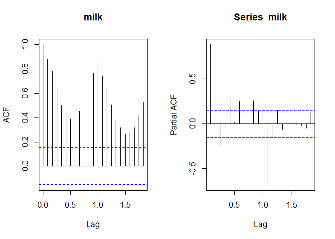<!-- -->

Checking the ACF and the PACF we can observe a significant lag around
one which corresponds to the one year seasonality. In addition in non
stationarity series we can see how the ACF and the PACF geometrically
decrease. Another way of checking non-stationarity is performing the
Ljung-Box test.

``` r
Box.test(milk,lag=24)
```

    ## 
    ##  Box-Pierce test
    ## 
    ## data:  milk
    ## X-squared = 1311.8, df = 24, p-value < 2.2e-16

The null hypothesis of this test is that we have independently
distributed As we obtained a low p-value we have to reject the null
hypothesis therefore the data is correlated and the series is not
stationary.

Now we are going to make the transformations in order to achieve
stationarity. To remove the trend we are going to take the first
differences.

``` r
dmilk<-diff(milk)
plot(dmilk, main="differnce series")
```

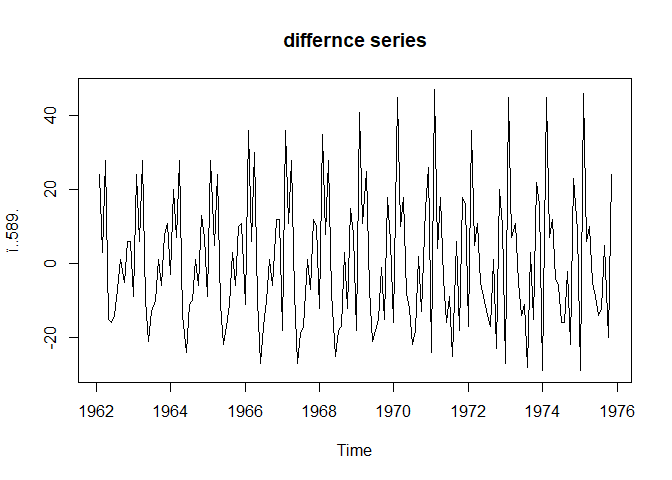<!-- -->

After removing the trend we can still see the seasonality of the time
series, so we are going to take differences again but with 12 lags of
difference in order to remove this seasonality.

``` r
ddmilk<-diff(dmilk, lag = 12)
plot(ddmilk, main="seasonal series")
```

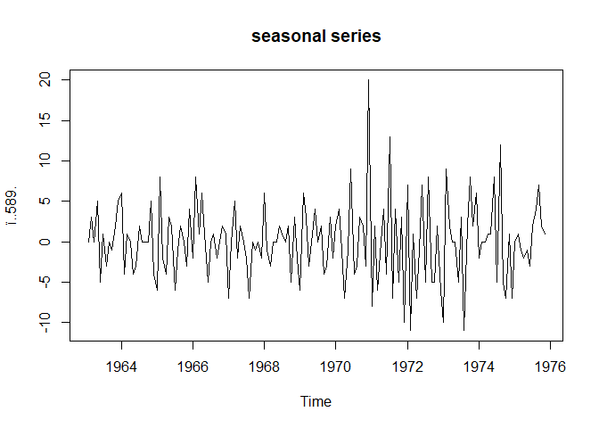<!-- -->

Now that we have removed the seasonality we can check the ACF and the
PACF.

``` r
par(mfrow=c(1,2))
acf(ddmilk,main="ddmilk")
pacf(ddmilk)
```

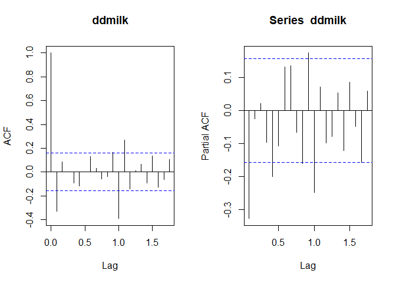<!-- -->

According to the ACF and the PACF we can see that the lag 1 is still
relevant. This means that there is still some seasonality, so there is
still correlation.

``` r
Box.test(ddmilk,lag=24)
```

    ## 
    ##  Box-Pierce test
    ## 
    ## data:  ddmilk
    ## X-squared = 79.396, df = 24, p-value = 7.592e-08

According to the box-pierce test we can confirm this. So in order to
choose a model we are going to make a decision based on the AIC of the
model as we cannot make a sensible decision based on the ACF and PACF
graphs. In addition the presence of outliers might be contaminating the
series. To check the AICs we are going to to take D = d = 1 which in
most of the cases is sufficient. The AIC is a criterion of model
selection which minimizes the final prediction error.

``` r
model1 = arima(milk,order=c(1,1,1),seasonal = c(0,1,2))
model2 = arima(milk,order=c(1,1,1),seasonal = c(0,1,1))
model3 = arima(milk,order=c(2,1,2),seasonal = c(0,1,1))
model4 = arima(milk,order=c(1,1,1),seasonal = c(2,1,0))
model5 = arima(milk,order=c(1,1,1),seasonal = c(1,1,0))
model6 = arima(milk,order=c(2,1,2),seasonal = c(1,1,0))
```

Now we check the AICs.

``` r
model1$aic
```

    ## [1] 885.4279

``` r
model2$aic
```

    ## [1] 887.1266

``` r
model3$aic
```

    ## [1] 884.825

``` r
model4$aic
```

    ## [1] 886.9206

``` r
model5$aic
```

    ## [1] 885.1028

``` r
model6$aic
```

    ## [1] 883.0109

According to the AIC the model 6 is the model that fits the best,
SARIMA(2,1,2)(1,1,0)\[12\]. To make the predictions we are going to
calculate the coefficients with the CSS-ML method.

``` r
f = arima(milk,order=c(2,1,2),seasonal=c(1,1,0), method = "CSS-ML")
f
```

    ## 
    ## Call:
    ## arima(x = milk, order = c(2, 1, 2), seasonal = c(1, 1, 0), method = "CSS-ML")
    ## 
    ## Coefficients:
    ##        ar1     ar2      ma1      ma2     sar1
    ##       0.61  0.2435  -0.9375  -0.0625  -0.3389
    ## s.e.  0.34  0.2832   0.3455   0.3449   0.0776
    ## 
    ## sigma^2 estimated as 16.29:  log likelihood = -435.51,  aic = 883.01

Now we are going to check the residuals of our fit, we are assuming that
\(a_{t} \sim \operatorname{Niid}\left(0, \sigma_{a}^{2}\right)\).

``` r
resid<-f$residuals
yest<-milk-resid
plot(milk)
lines(yest,col="red")
```

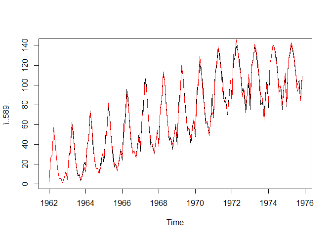<!-- -->

The residuals seem to be normally distributed although we are going to
check it in different ways.

``` r
par(mfrow=c(1,2))
acf(resid)
pacf(resid)
```

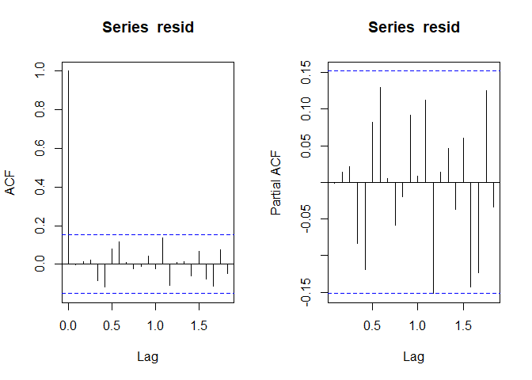<!-- -->

The ACF and the PACF correspond to a white noise process which is a good
sign.

``` r
par(mfrow=c(1,1))
qqnorm(resid)
qqline(resid)
```

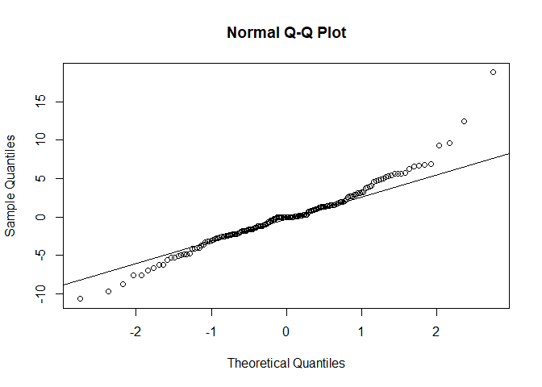<!-- -->

The qqplot is telling us that we have something different to a normal
distribution which is the distribution we are looking for. The last
check that we are going to make is to ensure that our residuals are
independent with a Box-test and a last normality check with the Jarque
Bera test.

``` r
Box.test(resid)
```

    ## 
    ##  Box-Pierce test
    ## 
    ## data:  resid
    ## X-squared = 0.00032447, df = 1, p-value = 0.9856

``` r
jarque.bera.test(resid)
```

    ## 
    ##  Jarque Bera Test
    ## 
    ## data:  resid
    ## X-squared = 84.674, df = 2, p-value < 2.2e-16

According to the Box test our residuals are independent and according to
the Jarque Bera test we have to reject the null hypothesis, this means
that we dont have normally distributed residuals. This could mean that
the model that we chose is not the correct one, so as we were assuming
gaussianity our MLE is going to be wrong probably. Although this could
be because the presence of outliers shift the residuals distribution.

``` r
pred = forecast(f,h=25)
fore = predict(f,n.ahead=25)
plot(pred)
lines(fore$pred,lwd=2,col="red")
lines(fore$pred+fore$se*1.96,lwd=2,col="red")
lines(fore$pred-fore$se*1.96,lwd=2,col="red")
```

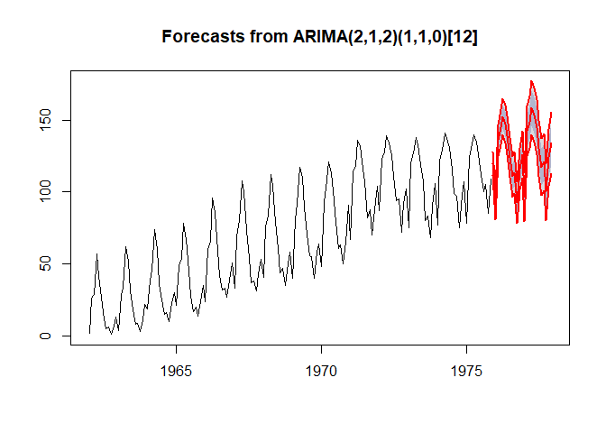<!-- -->

Although our prediction does not seem bad we are going to use auto.arima
in order to check if our prediction was good.

``` r
auto = auto.arima(milk)
auto
```

    ## Series: milk 
    ## ARIMA(1,0,1)(0,1,2)[12] with drift 
    ## 
    ## Coefficients:
    ##          ar1      ma1     sma1    sma2   drift
    ##       0.8859  -0.2015  -0.3766  0.1322  0.6159
    ## s.e.  0.0433   0.0891   0.0854  0.0836  0.1372
    ## 
    ## sigma^2 estimated as 16.65:  log likelihood=-436.76
    ## AIC=885.52   AICc=886.08   BIC=903.78

According to auto.arima we have a SARIMA(1,0,1)(0,1,2)\[12\] with drift.
So we are going to use this model use this model now to make our
predictions.

``` r
f2 = arima(milk,order=c(1,0,1),seasonal=c(0,1,2), method = "CSS-ML")
resid<-f2$residuals
yest<-milk-resid
plot(milk)
lines(yest,col="red")
```

<!-- -->

``` r
Box.test(resid)
```

    ## 
    ##  Box-Pierce test
    ## 
    ## data:  resid
    ## X-squared = 0.046846, df = 1, p-value = 0.8286

``` r
jarque.bera.test(resid)
```

    ## 
    ##  Jarque Bera Test
    ## 
    ## data:  resid
    ## X-squared = 84.591, df = 2, p-value < 2.2e-16

With the model provided by auto arima we do not have still nromally
distributed residuals, so probably the outliers are affecting the
normality of the residuals.

``` r
pred = forecast(auto,h=25)
plot(pred)
```

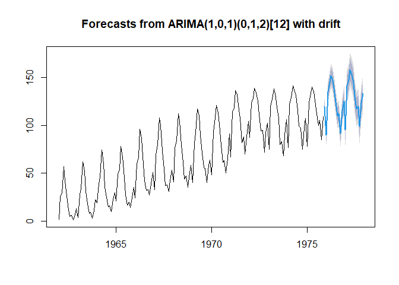<!-- -->

Both of them look like sensible models although auto arima model seems
to perform better. Now we are going to make the analysis with outliers
so we are going to use the function tso that analyzes our time series
its possible outliers.

``` r
milk_out = tso(milk,types=c("IO","AO","LS"))
milk_out
```

    ## Series: milk 
    ## Regression with ARIMA(0,1,0)(1,1,0)[12] errors 
    ## 
    ## Coefficients:
    ##          sar1    AO25    IO102    IO108    IO115   AO121     LS140
    ##       -0.3184  7.0506  10.3049  19.3616  11.7413  8.4368  -10.6867
    ## s.e.   0.0804  1.9335   3.3187   3.3216   3.3495  1.8899    2.6623
    ## 
    ## sigma^2 estimated as 11.54:  log likelihood=-403.88
    ## AIC=823.77   AICc=824.76   BIC=848.06
    ## 
    ## Outliers:
    ##   type ind    time coefhat  tstat
    ## 1   AO  25 1964:01   7.051  3.647
    ## 2   IO 102 1970:06  10.305  3.105
    ## 3   IO 108 1970:12  19.362  5.829
    ## 4   IO 115 1971:07  11.741  3.505
    ## 5   AO 121 1972:01   8.437  4.464
    ## 6   LS 140 1973:08 -10.687 -4.014

To discuss about this outliers we are going to plot again the time
series.

``` r
plot(milk)
```

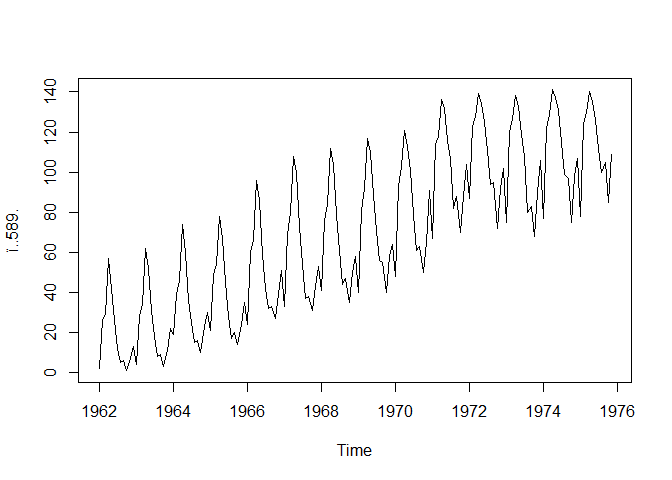<!-- -->

According to the tso function we have 6 outliers in this time series. 2
of them are additive outliers at 1964 and 1972, in 1964 according to the
general trend there was a smaller decrease as the expected one,
furthermore in 1972 there was also an isolated spike although both of
them do not look quite relevant. There are 3 innovative outliers between
1970 and 1971 where we can observe some anomalous behaviour. The most
relevant outlier seems to be the level shift outlier at 1973 where we
see that the slope of the trend decreases.

The model taking into account these outliers is a
SARIMA(0,1,0)(1,1,0)\[12\]. So we are going to use this model to make
our predictions.

``` r
plot(milk_out)
```

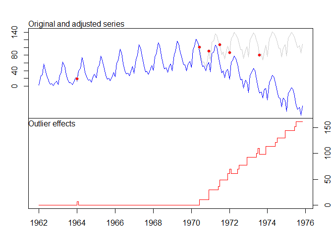<!-- -->

Here is the plot with the original series and the series without
outliers. We can see that the series would have gone downwards according
to the tso function, although this does not seem like a sensible
solution because we cannot get values below 0, as we cannot produce
negative pounds of milk.

# Second data set

``` r
ts <- read_delim("ts.txt", 
    "\t", escape_double = FALSE, trim_ws = TRUE)
```

    ## Parsed with column specification:
    ## cols(
    ##   `2016-05-02` = col_date(format = ""),
    ##   `90.52` = col_double(),
    ##   `147.72` = col_double(),
    ##   `29.91` = col_double()
    ## )

``` r
colnames(ts) = c("date","apple","ibm","intel")
ts = ts$apple
ts = rev(ts)
```

We are going to analyze the price (dolars) of the Apple stocks. The
series starts in 1980 and we have monthly evaluations. We can observe a
time series which is not stationary. The conditional mean is not
constant at all (we have a clear ascending trend) and the conditional
variance is neither constant. It seems that we do not have seasonality.

``` r
tserie = ts(ts,star=c(1980,1),freq=12)
plot(tserie)
```

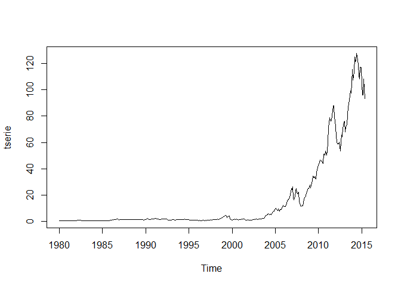<!-- -->

We are going to transform the time series to achieve stationarity. We
first take differences to achieve constant unconditional mean and
logarithms to obtain constant unconditional variance:

``` r
lts = log(ts)
dlts = diff(lts)
ts1 = ts(dlts,star=c(1980,1),freq=12)
plot(ts1)
```

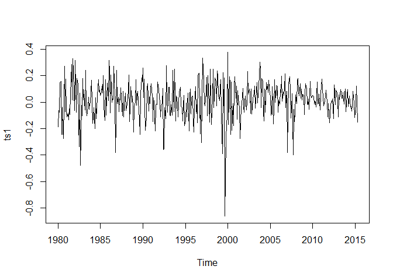<!-- -->

We want to check now what ARMA model we are dealing with, so we are
going to analyze the ACF and the PACF graphs.

``` r
par(mfrow=c(1,2))
acf(dlts)
pacf(dlts)
```

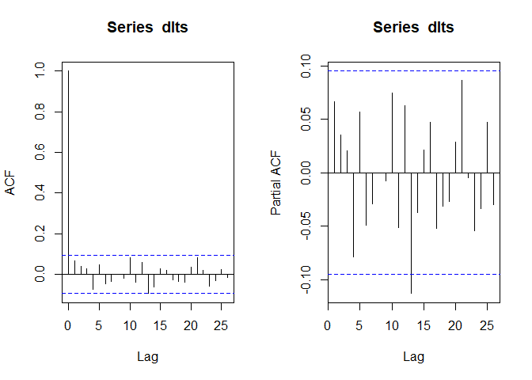<!-- -->

Analyzing the graphs makes us think that we have just white noise but we
have a significant lag at k=12, so we try taking differences with a
frequency of 12 and analyzing again the ACF and the PACF graphs. This is
because there could be some annual seasonality.

``` r
lts1 = log(ts)
dlts1 = diff(lts1, lag=12)
ts2 = ts(dlts1,star=c(1980,1),freq=12)
par(mfrow=c(1,2))
acf(dlts1)
pacf(dlts1)
```

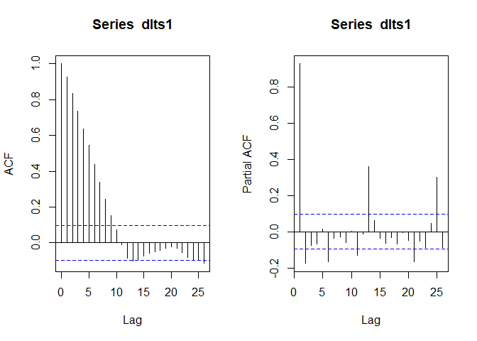<!-- -->

Now, observing the exponential decay of the ACF makes us think of an
AR(p) or an ARMA(p,q) process. Observing the PACF, with many significant
peaks, seems possible that the model is an ARMA(p,q) process. About the
values of p and, for the moment, does not seem clear. So we are going to
make use of arima to look for the model with smallest AIC to determine
our model. To check the AICs we are going to to take D = d = 1.

``` r
model1 = arima(tserie,order=c(1,1,1),seasonal = c(0,1,2))
model2 = arima(tserie,order=c(1,1,1),seasonal = c(0,1,1))
model3 = arima(tserie,order=c(2,1,2),seasonal = c(0,1,1))
model4 = arima(tserie,order=c(1,1,1),seasonal = c(2,1,0))
model5 = arima(tserie,order=c(1,1,1),seasonal = c(1,1,0))
model6 = arima(tserie,order=c(2,1,2),seasonal = c(1,1,0))
```

Now we check the AICs.

``` r
model1$aic
```

    ## [1] 1951.883

``` r
model2$aic
```

    ## [1] 1951.272

``` r
model3$aic
```

    ## [1] 1950.328

``` r
model4$aic
```

    ## [1] 1986.532

``` r
model5$aic
```

    ## [1] 2039.938

``` r
model6$aic
```

    ## [1] 2033.132

The model 3 corresponds with the smallest AIC. It is an
SARIMA(1,1,1)(2,1,0)\[12\]. We are going to calculate now the
coefficients with the CSS-ML method.

``` r
f = arima(tserie,order=c(1,1,1),seasonal=c(2,1,0), method = "CSS-ML")
f
```

    ## 
    ## Call:
    ## arima(x = tserie, order = c(1, 1, 1), seasonal = c(2, 1, 0), method = "CSS-ML")
    ## 
    ## Coefficients:
    ##           ar1     ma1     sar1     sar2
    ##       -0.8861  1.0000  -0.6963  -0.4640
    ## s.e.   0.0294  0.0186   0.0554   0.0583
    ## 
    ## sigma^2 estimated as 6.871:  log likelihood = -988.27,  aic = 1986.53

We observe now the residuals of our fit and check that it is normally
distributed, as it is supposed to be (we are assuming that the
innovations follow a Normal distribution).

``` r
resid<-f$residuals
yest<-tserie-resid
plot(tserie)
lines(yest,col="red")
```

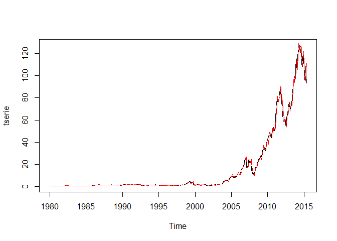<!-- -->

It seems that everything is okay but we are going to check with the ACF
and PACF.

``` r
par(mfrow=c(1,2))
acf(resid)
pacf(resid)
```

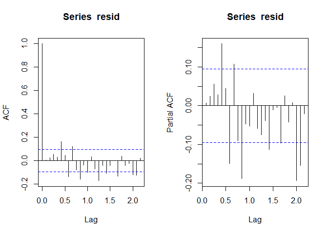<!-- -->

There are some significative lags in both the ACF and the PACF but not
big enough to consider them. Observing then the graphs we conclude that
the residuals could correspond to white noise. We perform a last check
to ensure that our residuals are independent with a Box-test and with
the Jarque Bera test.

``` r
Box.test(resid)
```

    ## 
    ##  Box-Pierce test
    ## 
    ## data:  resid
    ## X-squared = 0.016585, df = 1, p-value = 0.8975

``` r
jarque.bera.test(resid)
```

    ## 
    ##  Jarque Bera Test
    ## 
    ## data:  resid
    ## X-squared = 3141.6, df = 2, p-value < 2.2e-16

The Box-Pierce test tell us that there is no correlation between the
residuals. According to these tests, we do not have normallity. If our
Gaussian assumption does not hold, then our likelihood function is wrong
and MLE is not reliable. This could mean that the model we choose is not
the correct one, so as we were assuming gaussianity. This could happen
because the presence of outliers.

Now we are going to predict what will happen in the future with the time
series:

``` r
pred = forecast(f,h=25)
fore = predict(f,n.ahead=25)
plot(pred)
lines(fore$pred,lwd=2,col="red")
lines(fore$pred+fore$se*1.96,lwd=2,col="red")
lines(fore$pred-fore$se*1.96,lwd=2,col="red")
```

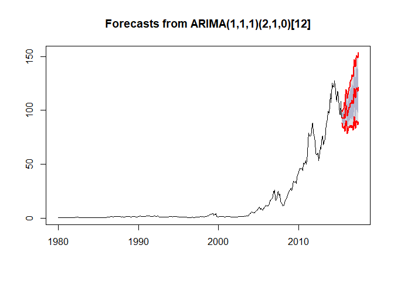<!-- -->

The prediction seems to be okay, but we are going to use auto.arima to
prove that our prediction was good.

``` r
auto = auto.arima(tserie)
auto
```

    ## Series: tserie 
    ## ARIMA(1,1,3)(0,0,2)[12] 
    ## 
    ## Coefficients:
    ##          ar1      ma1      ma2     ma3    sma1     sma2
    ##       0.7250  -0.6120  -0.3007  0.3816  0.0230  -0.0971
    ## s.e.  0.0702   0.0759   0.0591  0.0549  0.0585   0.0585
    ## 
    ## sigma^2 estimated as 5.807:  log likelihood=-971.91
    ## AIC=1957.83   AICc=1958.1   BIC=1986.17

According to auto.arima we have a ARIMA(1,1,3)(0,0,2)\[12\] with drift.
We will use this model to make our predictions.

``` r
pred = forecast(auto,h=25)
plot(pred)
```

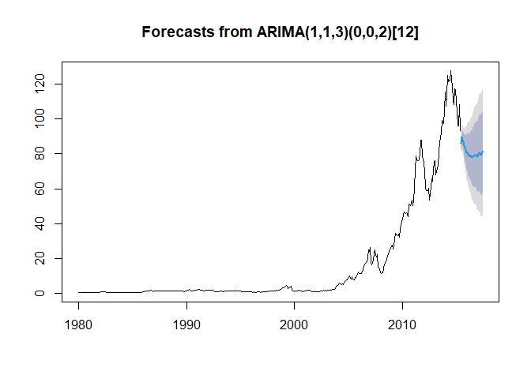<!-- -->

This second predictor model seems to be a little bit more pessimistic
about the future, but both of them seem to be sensible models. We
proceed now to make the analysis of possible outliers. According to the
auto arima we are having a descending trend and according to our
predictions we have an ascending trend.

``` r
out = tso(tserie,types=c("IO","AO","LS"))
```

    ## Warning in locate.outliers.iloop(resid = resid, pars = pars, cval = cval, :
    ## stopped when 'maxit.iloop' was reached

    ## Warning in locate.outliers.oloop(y = y, fit = fit, types = types, cval = cval, :
    ## stopped when 'maxit.oloop = 4' was reached

``` r
out
```

    ## Series: tserie 
    ## Regression with ARIMA(1,1,3) errors 
    ## 
    ## Coefficients:
    ##          ar1      ma1      ma2     ma3   IO323   IO368   IO407
    ##       0.6977  -0.5442  -0.2996  0.3410  3.0050  4.0414  1.7166
    ## s.e.  0.0850   0.0905   0.0570  0.0557  2.0177  2.0502  2.0716
    ## 
    ## sigma^2 estimated as 5.774:  log likelihood=-970.01
    ## AIC=1956.03   AICc=1956.38   BIC=1988.43
    ## 
    ## Outliers:
    ##   type ind    time coefhat  tstat
    ## 1   IO 323 2006:11   3.005 1.4893
    ## 2   IO 368 2010:08   4.041 1.9713
    ## 3   IO 407 2013:11   1.717 0.8287

It seems that we have 3 outliers, of the innovative kind: at November of
2006, August of 2010 and November of 2013. We are going to plot again
the series to analyze its behavior.

``` r
plot(out)
```

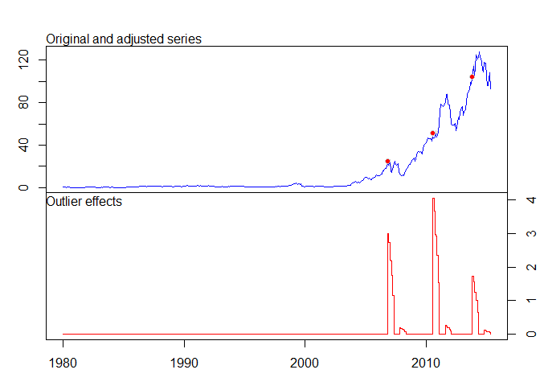<!-- -->

In the mentioned points we can see an abnormal behavior, but nothing
relevant. The series does not look to be affected by the outliers.

Looking at the residuals and the exponential trend of the series we
could try to fit a non linear model, there are some linear models like
the GARCH or the ARCH model.
