Cox Model
================
Roberto Rey
13/4/2021

We load the libraries required.

``` r
library(survival)
library(MASS)
library(VIM)
library(ggplot2)
library(survminer)
library(tidyverse)
library(reshape2)
```

We load the data

``` r
data(mgus)
data = mgus2
```

We pre-process the data, first we check the proportions of NAs and we
chose to remove them as they were negligible.

``` r
sum(is.na(data))/nrow(data)
```

    ## [1] 0.03901734

``` r
summary(data) #hgb creat and mspike has NAs
```

    ##        id              age        sex          dxyr           hgb      
    ##  Min.   :   1.0   Min.   :24.00   F:631   Min.   :1960   Min.   : 5.7  
    ##  1st Qu.: 346.8   1st Qu.:63.00   M:753   1st Qu.:1980   1st Qu.:12.2  
    ##  Median : 692.5   Median :72.00           Median :1984   Median :13.5  
    ##  Mean   : 692.5   Mean   :70.42           Mean   :1983   Mean   :13.3  
    ##  3rd Qu.:1038.2   3rd Qu.:79.00           3rd Qu.:1988   3rd Qu.:14.7  
    ##  Max.   :1384.0   Max.   :96.00           Max.   :1994   Max.   :18.9  
    ##                                                          NA's   :13    
    ##      creat            mspike          ptime            pstat        
    ##  Min.   : 0.400   Min.   :0.000   Min.   :  1.00   Min.   :0.00000  
    ##  1st Qu.: 0.900   1st Qu.:0.600   1st Qu.: 37.00   1st Qu.:0.00000  
    ##  Median : 1.100   Median :1.200   Median : 81.00   Median :0.00000  
    ##  Mean   : 1.292   Mean   :1.164   Mean   : 93.54   Mean   :0.08309  
    ##  3rd Qu.: 1.300   3rd Qu.:1.500   3rd Qu.:136.25   3rd Qu.:0.00000  
    ##  Max.   :22.000   Max.   :3.000   Max.   :424.00   Max.   :1.00000  
    ##  NA's   :30       NA's   :11                                        
    ##      futime          death       
    ##  Min.   :  1.0   Min.   :0.0000  
    ##  1st Qu.: 40.0   1st Qu.:0.0000  
    ##  Median : 84.0   Median :1.0000  
    ##  Mean   : 95.8   Mean   :0.6958  
    ##  3rd Qu.:139.0   3rd Qu.:1.0000  
    ##  Max.   :424.0   Max.   :1.0000  
    ## 

``` r
mice_plot <- aggr(data[,c(4:6)], col=c('navyblue','yellow'),
                  numbers=TRUE, sortVars=TRUE,
                  labels=names(data[,c(4:6)]), cex.axis=.9,
                  gap=2, ylab=c("Missing data","Pattern")) #Outlier proportion
```

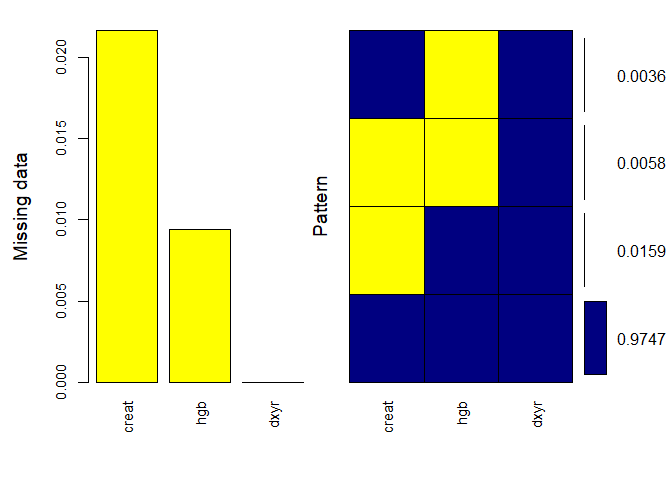<!-- -->

    ## 
    ##  Variables sorted by number of missings: 
    ##  Variable       Count
    ##     creat 0.021676301
    ##       hgb 0.009393064
    ##      dxyr 0.000000000

``` r
data = na.omit(data) # We remove the rows with NAs
```

During the project we encountered several problems with some outliers so
we calculated the Cook’s Distance.

``` r
mod <- lm(futime ~ age+dxyr+hgb+creat+mspike+ptime, data = data)
cooksd <- cooks.distance(mod)
# Plot the Cook's Distance using the traditional 4/n criterion
sample_size = nrow(data)
plot(cooksd, pch="*", cex=2, main="Influential Obs by Cooks distance")  # plot cook's distance
abline(h = 4/sample_size, col="red")  # add cutoff line
text(x=1:length(cooksd)+1, y=cooksd, labels=ifelse(cooksd>4/sample_size, names(cooksd),""), col="red")  # add labels
```

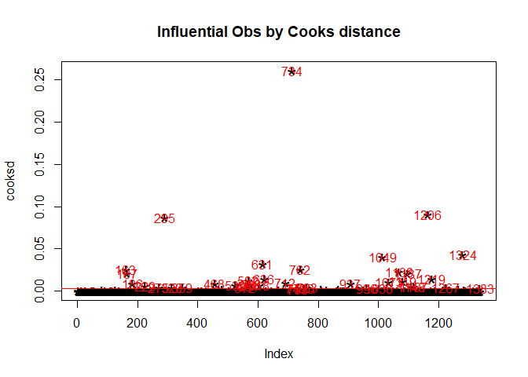<!-- -->

And we removed them.

``` r
influential = as.numeric(names(cooksd)[(cooksd > (4/sample_size))])
length(influential) #40 outliers
```

    ## [1] 39

``` r
data = data[-influential, ]
```

We check for multicollinearity

``` r
par(mfrow=c(1,1))
M <- cor(data[,c(2,4:7,10)])
corrplot::corrplot(M, method = "color")
```

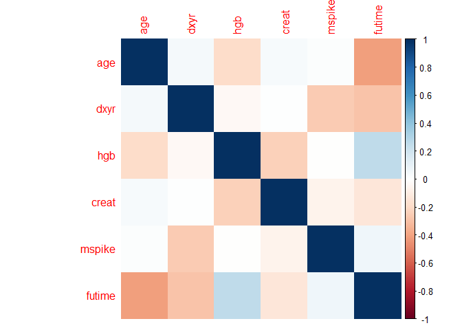<!-- -->

There is no significant correlation between the variables, the highest
one is the correlation between age and futime although is smaller than
0.6 in absolute value.

Once we have preprocessed our data we are going to start building our
model. To determine which model we are going to use, we have to check
which kind of data we have. First of all, we can see that we have
covariates that have fixed values which we are going to consider them as
constant and we also have a time dependent covariate called pstat and
indicates that a pacient has developed a PCM. Also, it is associated
with ptime which is the month at which the patient developed the PCM.

``` r
td_data = tmerge(data, data, id=id,
                death=event(futime, death),PCM=tdc(ptime))
head(td_data)
```

    ##   id age sex dxyr  hgb creat mspike ptime pstat futime death tstart tstop PCM
    ## 1  1  88   F 1981 13.1   1.3    0.5    30     0     30     1      0    30   0
    ## 2  2  78   F 1968 11.5   1.2    2.0    25     0     25     1      0    25   0
    ## 3  3  94   M 1980 10.5   1.5    2.6    46     0     46     1      0    46   0
    ## 4  4  68   M 1977 15.2   1.2    1.2    92     0     92     1      0    92   0
    ## 5  5  90   F 1973 10.7   0.8    1.0     8     0      8     1      0     8   0
    ## 6  6  90   M 1990 12.9   1.0    0.5     4     0      4     1      0     4   0

We fit the full model, including every interaction.

``` r
fit.all = coxph(Surv(tstart, tstop, death) ~ (age+sex+dxyr+hgb+creat
              +mspike+PCM)^2, data=td_data)
fit.all
```

    ## Call:
    ## coxph(formula = Surv(tstart, tstop, death) ~ (age + sex + dxyr + 
    ##     hgb + creat + mspike + PCM)^2, data = td_data)
    ## 
    ##                    coef  exp(coef)   se(coef)      z        p
    ## age           1.764e+00  5.833e+00  1.150e+00  1.534  0.12505
    ## sexM         -1.229e+01  4.593e-06  2.390e+01 -0.514  0.60710
    ## dxyr          1.475e-01  1.159e+00  6.280e-02  2.349  0.01884
    ## hgb           8.701e+00  6.011e+03  6.187e+00  1.406  0.15958
    ## creat         6.409e+00  6.072e+02  1.524e+01  0.421  0.67407
    ## mspike        3.500e+01  1.583e+15  1.962e+01  1.784  0.07447
    ## PCM          -4.335e+00  1.310e-02  3.702e+01 -0.117  0.90677
    ## age:sexM     -1.531e-02  9.848e-01  7.608e-03 -2.013  0.04412
    ## age:dxyr     -9.162e-04  9.991e-01  5.780e-04 -1.585  0.11297
    ## age:hgb       8.095e-03  1.008e+00  1.806e-03  4.481 7.41e-06
    ## age:creat     4.241e-03  1.004e+00  3.972e-03  1.068  0.28567
    ## age:mspike    9.467e-03  1.010e+00  7.174e-03  1.320  0.18697
    ## age:PCM      -1.139e-02  9.887e-01  1.336e-02 -0.852  0.39394
    ## sexM:dxyr     6.821e-03  1.007e+00  1.206e-02  0.566  0.57169
    ## sexM:hgb      3.092e-02  1.031e+00  3.837e-02  0.806  0.42025
    ## sexM:creat    2.393e-03  1.002e+00  9.024e-02  0.027  0.97884
    ## sexM:mspike  -5.338e-02  9.480e-01  1.399e-01 -0.382  0.70278
    ## sexM:PCM     -4.119e-01  6.624e-01  2.793e-01 -1.474  0.14035
    ## dxyr:hgb     -4.797e-03  9.952e-01  3.126e-03 -1.534  0.12497
    ## dxyr:creat   -3.611e-03  9.964e-01  7.660e-03 -0.471  0.63732
    ## dxyr:mspike  -1.796e-02  9.822e-01  9.895e-03 -1.815  0.06949
    ## dxyr:PCM      2.985e-03  1.003e+00  1.881e-02  0.159  0.87394
    ## hgb:creat     5.848e-02  1.060e+00  1.891e-02  3.092  0.00199
    ## hgb:mspike   -4.061e-03  9.959e-01  3.707e-02 -0.110  0.91275
    ## hgb:PCM       8.895e-02  1.093e+00  6.553e-02  1.358  0.17462
    ## creat:mspike -1.725e-02  9.829e-01  7.726e-02 -0.223  0.82336
    ## creat:PCM    -7.633e-02  9.265e-01  3.433e-01 -0.222  0.82405
    ## mspike:PCM   -2.491e-02  9.754e-01  2.258e-01 -0.110  0.91215
    ## 
    ## Likelihood ratio test=624.2  on 28 df, p=< 2.2e-16
    ## n= 1401, number of events= 909

Now we use the BIC criterion to determine our final model.

``` r
best = step(fit.all, direction="both", k=log(nrow(td_data)))
```

``` r
best
```

    ## Call:
    ## coxph(formula = Surv(tstart, tstop, death) ~ age + sex + hgb + 
    ##     creat + PCM + age:hgb + hgb:creat, data = td_data)
    ## 
    ##                coef exp(coef)  se(coef)      z        p
    ## age       -0.011599  0.988468  0.019685 -0.589 0.555705
    ## sexM       0.406822  1.502037  0.071063  5.725 1.04e-08
    ## hgb       -0.593302  0.552500  0.114596 -5.177 2.25e-07
    ## creat     -0.498605  0.607377  0.109827 -4.540 5.63e-06
    ## PCM        1.599045  4.948307  0.115376 13.859  < 2e-16
    ## age:hgb    0.005414  1.005428  0.001522  3.556 0.000376
    ## hgb:creat  0.062353  1.064338  0.011452  5.445 5.19e-08
    ## 
    ## Likelihood ratio test=601  on 7 df, p=< 2.2e-16
    ## n= 1401, number of events= 909

Now we create the final model.

``` r
final.model = coxph(formula = Surv(tstart, tstop, death) ~ age + sex + hgb + 
                      creat + PCM + age:hgb + hgb:creat, data = td_data)
final.model
```

    ## Call:
    ## coxph(formula = Surv(tstart, tstop, death) ~ age + sex + hgb + 
    ##     creat + PCM + age:hgb + hgb:creat, data = td_data)
    ## 
    ##                coef exp(coef)  se(coef)      z        p
    ## age       -0.011599  0.988468  0.019685 -0.589 0.555705
    ## sexM       0.406822  1.502037  0.071063  5.725 1.04e-08
    ## hgb       -0.593302  0.552500  0.114596 -5.177 2.25e-07
    ## creat     -0.498605  0.607377  0.109827 -4.540 5.63e-06
    ## PCM        1.599045  4.948307  0.115376 13.859  < 2e-16
    ## age:hgb    0.005414  1.005428  0.001522  3.556 0.000376
    ## hgb:creat  0.062353  1.064338  0.011452  5.445 5.19e-08
    ## 
    ## Likelihood ratio test=601  on 7 df, p=< 2.2e-16
    ## n= 1401, number of events= 909

``` r
summary(final.model)
```

    ## Call:
    ## coxph(formula = Surv(tstart, tstop, death) ~ age + sex + hgb + 
    ##     creat + PCM + age:hgb + hgb:creat, data = td_data)
    ## 
    ##   n= 1401, number of events= 909 
    ## 
    ##                coef exp(coef)  se(coef)      z Pr(>|z|)    
    ## age       -0.011599  0.988468  0.019685 -0.589 0.555705    
    ## sexM       0.406822  1.502037  0.071063  5.725 1.04e-08 ***
    ## hgb       -0.593302  0.552500  0.114596 -5.177 2.25e-07 ***
    ## creat     -0.498605  0.607377  0.109827 -4.540 5.63e-06 ***
    ## PCM        1.599045  4.948307  0.115376 13.859  < 2e-16 ***
    ## age:hgb    0.005414  1.005428  0.001522  3.556 0.000376 ***
    ## hgb:creat  0.062353  1.064338  0.011452  5.445 5.19e-08 ***
    ## ---
    ## Signif. codes:  0 '***' 0.001 '**' 0.01 '*' 0.05 '.' 0.1 ' ' 1
    ## 
    ##           exp(coef) exp(-coef) lower .95 upper .95
    ## age          0.9885     1.0117    0.9511    1.0273
    ## sexM         1.5020     0.6658    1.3067    1.7265
    ## hgb          0.5525     1.8100    0.4414    0.6916
    ## creat        0.6074     1.6464    0.4897    0.7533
    ## PCM          4.9483     0.2021    3.9468    6.2039
    ## age:hgb      1.0054     0.9946    1.0024    1.0084
    ## hgb:creat    1.0643     0.9396    1.0407    1.0885
    ## 
    ## Concordance= 0.714  (se = 0.009 )
    ## Likelihood ratio test= 601  on 7 df,   p=<2e-16
    ## Wald test            = 572.5  on 7 df,   p=<2e-16
    ## Score (logrank) test = 657.1  on 7 df,   p=<2e-16

Now we start performing the model diagnostics, so we fit the model
without the covariate, calculate the martingale residuals and plot the
residuals versus the covariates.

``` r
smoothSEcurve = function(yy,xx){ 
  xx.list = min(xx) + ((0:100)/100)*(max(xx)-min(xx))
  yy.xx = predict(loess(yy~xx), se=T, newdata = data.frame(xx=xx.list))
  lines(yy.xx$fit~xx.list,lwd=2)
  lines(yy.xx$fit - qt(0.975,yy.xx$df)*yy.xx$se.fit ~ xx.list, lty=2 )
  lines(yy.xx$fit + qt(0.975,yy.xx$df)*yy.xx$se.fit ~ xx.list, lty=2 ) }
```

HGB residuals.

``` r
final.model2 = coxph(formula = Surv(tstart, tstop, death) ~ age + sex + 
                       creat + PCM , data = td_data)

summary(final.model2)
```

    ## Call:
    ## coxph(formula = Surv(tstart, tstop, death) ~ age + sex + creat + 
    ##     PCM, data = td_data)
    ## 
    ##   n= 1401, number of events= 909 
    ## 
    ##           coef exp(coef) se(coef)      z Pr(>|z|)    
    ## age   0.063887  1.065972 0.003616 17.670  < 2e-16 ***
    ## sexM  0.355683  1.427155 0.067616  5.260 1.44e-07 ***
    ## creat 0.091606  1.095932 0.017071  5.366 8.04e-08 ***
    ## PCM   1.637556  5.142586 0.114962 14.244  < 2e-16 ***
    ## ---
    ## Signif. codes:  0 '***' 0.001 '**' 0.01 '*' 0.05 '.' 0.1 ' ' 1
    ## 
    ##       exp(coef) exp(-coef) lower .95 upper .95
    ## age       1.066     0.9381     1.058     1.074
    ## sexM      1.427     0.7007     1.250     1.629
    ## creat     1.096     0.9125     1.060     1.133
    ## PCM       5.143     0.1945     4.105     6.442
    ## 
    ## Concordance= 0.692  (se = 0.01 )
    ## Likelihood ratio test= 523.5  on 4 df,   p=<2e-16
    ## Wald test            = 510.4  on 4 df,   p=<2e-16
    ## Score (logrank) test = 563.7  on 4 df,   p=<2e-16

``` r
rr = residuals(final.model2, type="martingale")
plot(rr ~ td_data$hgb, xlab="hgb")
smoothSEcurve(rr, td_data$hgb)
title("Martingale residuals\nversus hgb")
```

<!-- --> Age
residuals.

``` r
final.model3 = coxph(formula = Surv(tstart, tstop, death) ~ hgb + sex + 
                       creat + PCM +hgb:creat, data = td_data)

summary(final.model3)
```

    ## Call:
    ## coxph(formula = Surv(tstart, tstop, death) ~ hgb + sex + creat + 
    ##     PCM + hgb:creat, data = td_data)
    ## 
    ##   n= 1401, number of events= 909 
    ## 
    ##               coef exp(coef) se(coef)       z Pr(>|z|)    
    ## hgb       -0.25876   0.77201  0.02180 -11.871  < 2e-16 ***
    ## sexM       0.32085   1.37830  0.07104   4.516 6.29e-06 ***
    ## creat     -0.60868   0.54407  0.10603  -5.741 9.42e-09 ***
    ## PCM        1.51325   4.54147  0.11527  13.128  < 2e-16 ***
    ## hgb:creat  0.07186   1.07450  0.01037   6.931 4.17e-12 ***
    ## ---
    ## Signif. codes:  0 '***' 0.001 '**' 0.01 '*' 0.05 '.' 0.1 ' ' 1
    ## 
    ##           exp(coef) exp(-coef) lower .95 upper .95
    ## hgb          0.7720     1.2953    0.7397    0.8057
    ## sexM         1.3783     0.7255    1.1991    1.5842
    ## creat        0.5441     1.8380    0.4420    0.6697
    ## PCM          4.5415     0.2202    3.6231    5.6927
    ## hgb:creat    1.0745     0.9307    1.0529    1.0966
    ## 
    ## Concordance= 0.657  (se = 0.01 )
    ## Likelihood ratio test= 290.9  on 5 df,   p=<2e-16
    ## Wald test            = 392.9  on 5 df,   p=<2e-16
    ## Score (logrank) test = 429  on 5 df,   p=<2e-16

``` r
rr = residuals(final.model3, type="martingale")
plot(rr ~ td_data$age, xlab="age")
smoothSEcurve(rr, td_data$age)
title("Martingale residuals\nversus age")
```

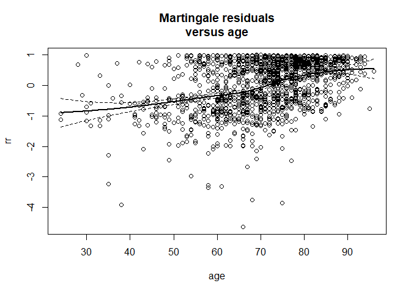<!-- -->

Creat residuals.

``` r
final.model4 = coxph(formula = Surv(tstart, tstop, death) ~age+ hgb+hgb:age + sex + PCM , data = td_data)

summary(final.model4)
```

    ## Call:
    ## coxph(formula = Surv(tstart, tstop, death) ~ age + hgb + hgb:age + 
    ##     sex + PCM, data = td_data)
    ## 
    ##   n= 1401, number of events= 909 
    ## 
    ##              coef exp(coef)  se(coef)      z Pr(>|z|)    
    ## age     -0.016204  0.983926  0.019530 -0.830 0.406689    
    ## hgb     -0.562120  0.570000  0.112166 -5.011 5.40e-07 ***
    ## sexM     0.495555  1.641408  0.069110  7.171 7.47e-13 ***
    ## PCM      1.574259  4.827165  0.115292 13.655  < 2e-16 ***
    ## age:hgb  0.005814  1.005831  0.001511  3.848 0.000119 ***
    ## ---
    ## Signif. codes:  0 '***' 0.001 '**' 0.01 '*' 0.05 '.' 0.1 ' ' 1
    ## 
    ##         exp(coef) exp(-coef) lower .95 upper .95
    ## age        0.9839     1.0163    0.9470    1.0223
    ## hgb        0.5700     1.7544    0.4575    0.7102
    ## sexM       1.6414     0.6092    1.4335    1.8795
    ## PCM        4.8272     0.2072    3.8508    6.0510
    ## age:hgb    1.0058     0.9942    1.0029    1.0088
    ## 
    ## Concordance= 0.709  (se = 0.009 )
    ## Likelihood ratio test= 573.4  on 5 df,   p=<2e-16
    ## Wald test            = 538.8  on 5 df,   p=<2e-16
    ## Score (logrank) test = 618.2  on 5 df,   p=<2e-16

``` r
rr = residuals(final.model4, type="martingale")
plot(rr ~ td_data$creat, xlab="creat")
smoothSEcurve(rr, td_data$creat)
title("Martingale residuals\nversus creat")
```

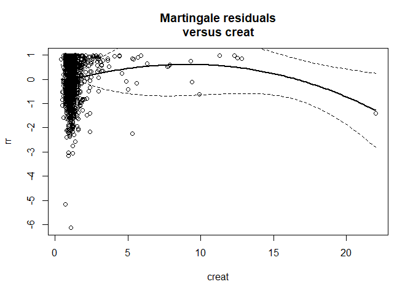<!-- -->

As we can see the residuals look fairly linear except for the creatine,
checking the residuals we could say that log-hazard ratio might not be
linear. So trying to fit a penalized spline in order to reflect this non
linear relationship, looking at the graph looks like we need a second
order spline.

We are going to check if the proportional hazard assumtion hold whis is
that the coefficient does not change over time. With the function
cox.zph we are going to obtain an estimate of \(\beta(t)\). The null
hypothesis of this function is that the coefficients are not time
dependent.

``` r
ph.test=cox.zph(final.model)
ph.test #Age, HGB and interaction time dependent
```

    ##             chisq df       p
    ## age       25.0905  1 5.5e-07
    ## sex        0.1653  1 0.68436
    ## hgb       14.9111  1 0.00011
    ## creat      1.0039  1 0.31638
    ## PCM        0.0553  1 0.81401
    ## age:hgb   33.2937  1 7.9e-09
    ## hgb:creat  0.1409  1 0.70740
    ## GLOBAL    53.5821  7 2.8e-09

And we plot the coefficients over time.

Age.

``` r
plot(ph.test[1])
abline(h=0, lty=3,lw=3,col=2) #Age
```

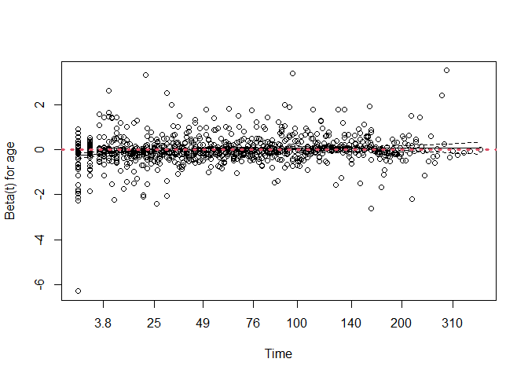<!-- -->

HGB.

``` r
plot(ph.test[3])
abline(h=0, lty=3,lw=3,col=2) # HGB
```

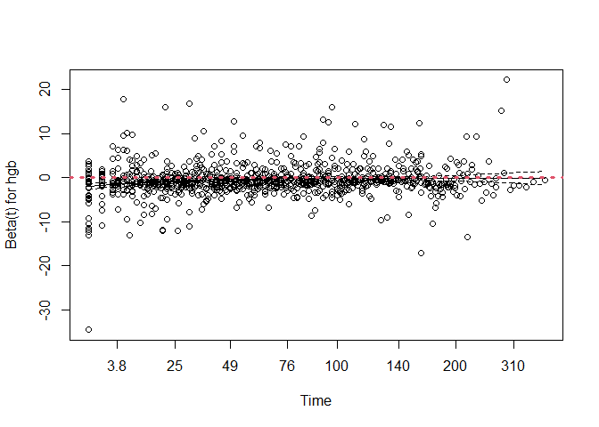<!-- -->

Age:HGB

``` r
plot(ph.test[6])
abline(h=0, lty=3,lw=3,col=2) #Interaction
```

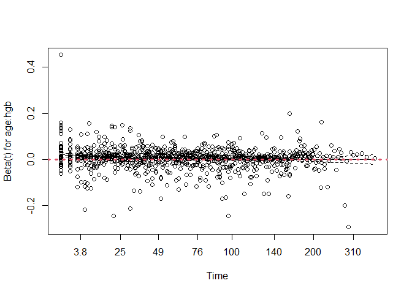<!-- -->

In the 3 of them we drew a red dotted line at height zero, which is the
value that we are expecting. As we can see all of them look constant
around 0, we can see high variability although we cannot see any
relevant time dependency, so we decided to continue with this model.

``` r
final.model = coxph(formula = Surv(tstart, tstop, death) ~ age + sex + hgb + 
                      pspline(creat,df=2) + PCM + age:hgb + hgb:creat, data = td_data)
final.model
```

    ## Call:
    ## coxph(formula = Surv(tstart, tstop, death) ~ age + sex + hgb + 
    ##     pspline(creat, df = 2) + PCM + age:hgb + hgb:creat, data = td_data)
    ## 
    ##                                coef  se(coef)       se2     Chisq   DF       p
    ## age                        -0.01007   0.01975   0.01969   0.25996 1.00 0.61015
    ## sexM                        0.39206   0.07183   0.07155  29.78736 1.00 4.8e-08
    ## hgb                        -0.55967   0.11661   0.11607  23.03561 1.00 1.6e-06
    ## pspline(creat, df = 2), l  -0.48117   0.12776   0.12710  14.18530 1.00 0.00017
    ## pspline(creat, df = 2), n                                 4.34140 1.06 0.04041
    ## PCM                         1.60188   0.11532   0.11532 192.94683 1.00 < 2e-16
    ## age:hgb                     0.00530   0.00153   0.00152  12.09537 1.00 0.00051
    ## hgb:creat                   0.04472   0.01585   0.01513   7.96388 1.00 0.00477
    ## 
    ## Iterations: 3 outer, 10 Newton-Raphson
    ##      Theta= 0.789 
    ## Degrees of freedom for terms= 1.0 1.0 1.0 2.1 1.0 1.0 0.9 
    ## Likelihood ratio test=606  on 7.94 df, p=<2e-16
    ## n= 1401, number of events= 909

Now we are going to plot the survival curve of our data, this survival
curve was obtained with the Kaplan-Meier estimator.

``` r
fit = survfit(Surv(tstart, tstop, death) ~ 1, data=td_data)
plot(fit)
```

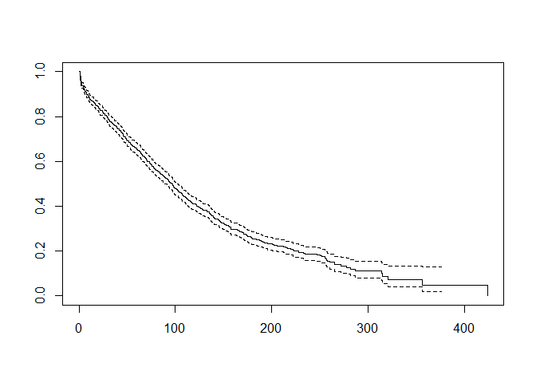<!-- -->

Now we compare the differences between having a PCM and not having a
PCM.

``` r
fit.PCM = survfit(Surv(tstart, tstop, death) ~ PCM, data=td_data)
plot(fit.PCM,lty=1:2,col=1:2,xlab="Time",ylab="Survival")
legend(300,1,legend=c("No PCM", "PCM"), lty=1:2, col=1:2, cex=0.8,
       box.lty=1) 
```

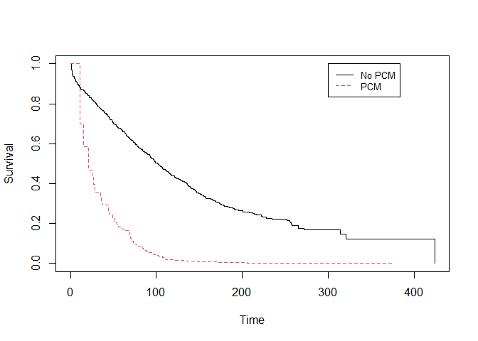<!-- -->

As we can observe, the difference is very noticeable they look like two
different curves.

The next curves that we are going to compare for the sex coefficient, we
see the curve for females and another curve for males.

``` r
fit.sex = survfit(Surv(tstart, tstop, death) ~ sex, data=td_data)
plot(fit.sex,lty=1:2,col=1:2,xlab="Time",ylab="Survival")
legend(325,1,legend=c("F", "M"), lty=1:2, col=1:2, cex=0.8,
       box.lty=1) 
```

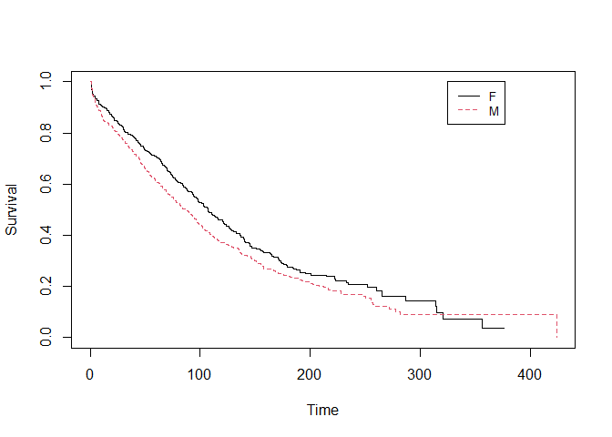<!-- -->

Both of them look pretty similar, we can appreciate that male’s curve is
a bit lower nearly until the end.

So now we have the exp(coefs).

``` r
summary(final.model)
```

    ## Call:
    ## coxph(formula = Surv(tstart, tstop, death) ~ age + sex + hgb + 
    ##     pspline(creat, df = 2) + PCM + age:hgb + hgb:creat, data = td_data)
    ## 
    ##   n= 1401, number of events= 909 
    ## 
    ##                           coef      se(coef) se2      Chisq  DF   p      
    ## age                       -0.010069 0.019748 0.019693   0.26 1.00 6.1e-01
    ## sexM                       0.392060 0.071835 0.071547  29.79 1.00 4.8e-08
    ## hgb                       -0.559673 0.116610 0.116068  23.04 1.00 1.6e-06
    ## pspline(creat, df = 2), l -0.481171 0.127756 0.127099  14.19 1.00 1.7e-04
    ## pspline(creat, df = 2), n                               4.34 1.06 4.0e-02
    ## PCM                        1.601883 0.115322 0.115318 192.95 1.00 7.2e-44
    ## age:hgb                    0.005305 0.001525 0.001523  12.10 1.00 5.1e-04
    ## hgb:creat                  0.044719 0.015846 0.015131   7.96 1.00 4.8e-03
    ## 
    ##            exp(coef) exp(-coef) lower .95 upper .95
    ## age        9.900e-01  1.010e+00 9.524e-01   1.02905
    ## sexM       1.480e+00  6.757e-01 1.286e+00   1.70379
    ## hgb        5.714e-01  1.750e+00 4.547e-01   0.71812
    ## ps(creat)3 4.035e-01  2.478e+00 6.477e-02   2.51398
    ## ps(creat)4 1.417e-01  7.056e+00 5.647e-03   3.55674
    ## ps(creat)5 3.411e-02  2.931e+01 3.954e-04   2.94356
    ## ps(creat)6 6.904e-03  1.448e+02 2.547e-05   1.87098
    ## ps(creat)7 1.014e-03  9.861e+02 1.407e-06   0.73072
    ## ps(creat)8 1.241e-04  8.061e+03 6.997e-08   0.21993
    ## ps(creat)9 1.472e-05  6.794e+04 2.978e-09   0.07275
    ## PCM        4.962e+00  2.015e-01 3.958e+00   6.22087
    ## age:hgb    1.005e+00  9.947e-01 1.002e+00   1.00833
    ## hgb:creat  1.046e+00  9.563e-01 1.014e+00   1.07872
    ## 
    ## Iterations: 3 outer, 10 Newton-Raphson
    ##      Theta= 0.7894509 
    ## Degrees of freedom for terms= 1.0 1.0 1.0 2.1 1.0 1.0 0.9 
    ## Concordance= 0.715  (se = 0.715 )
    ## Likelihood ratio test= 605.9  on 7.94 df,   p=<2e-16

The next plot that we are going to do, is the coefficients (hazard
ratios) plot.

``` r
ggforest(final.model, data = td_data)
```

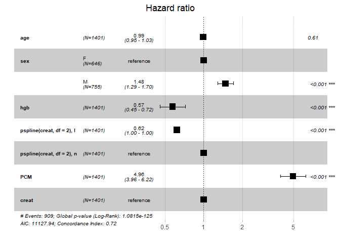<!-- -->

In order to interpret the coefficients, we check the exponential of the
coeficient which is going to indicate how the hazard ratio changes for a
unit increase in the covariates. First we discuss the categorical
variables which are sex and PCM. According to sex we cannot interpret as
a change in one unit, we have the ‘female’ category as a reference so we
have the coefficient according to the males, when the patient is a male
the hazard ratio increases by 48%. According to the PCM, our reference
level is when the patient does not have a PCM, so the coefficient means
that when patient develops a PCM the hazard ratio increases by 396%. Now
we are going to analyze the numerical variables, age does not seem
relevant according to its p-value. Looking at the hemoglobin, the hazard
ratio for a unit change is 0.57. This means that each unit in hemoglobin
decreases the hazard ratio by 43%. The last numerical variable is
creatine, it has a hazard ratio for a unit change of 0.62 which means
that each unit in creatinine decreases the hazard ratio by 38%. It seems
that high levels of hemoglobin and low levels of creatine are risk
factors to take into account for patients which might derive in a bad
progression of their disease.

The last two variables that we have to interpret are the interactions.
On the one hand, the first interaction is age:hgb, it indicates that
there is a relationship between age and hemoglobin which is significant
to the model. This interaction increases the hazard ratio by 0.5%. On
the other hand, the other interaction is hgb:creat, there seems to be a
relationship between hemolobin and creatine, each unit in this
interaction increases the hazard ratio by 4.5%.
