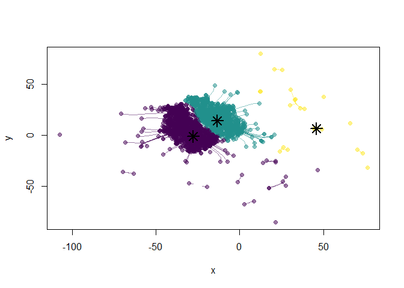
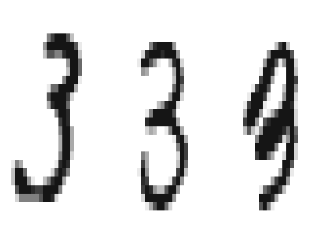

Kernel mean shift clustering
================
Roberto Rey
14/3/2020

# Kernel Mean Shift Clustering

First we load the MNIST dataset, we are interested in filtering the ones
that represent the number 3, furthermore we are only taking 2000
observations for the sake of computational expediency.

``` r
load("MNIST-tSNE.RData")
labels = MNIST$labels
bool_3 = labels == 3
data = MNIST$y_tsne
data = data[bool_3,]
data = data[1:2000,]
```

Now we compute the normal scale bandwidth matrix that is appropriate for
performing kernel mean shift clustering.

``` r
H = ks::Hns(x = data, deriv.order = 1)
```

We perform kernel mean shift clustering on that subset using the
previously obtained bandwidth and obtain the modes.

``` r
kms = ks::kms(x = data, H = H, keep.path = TRUE)

# Plot clusters
cols <- viridis::viridis(kms$nclust, alpha = 0.5)[kms$label]
plot(data, col = cols, pch = 19, xlab = "x", ylab = "y")
for (i in 1:nrow(data)) lines(kms$path[[i]], col = cols[i])
points(kms$mode, pch = 8, cex = 2, lwd = 2)
```

<!-- -->

Finally we determine the M images that have the closest t-SNE scores,
using the Euclidean distance to the modes.

``` r
data2 = rbind(data, kms$mode)
distancias = as.matrix(dist(data2))
dim(distancias)
```

    ## [1] 2003 2003

``` r
min1 = which.min(distancias[2001,-2001])
min2 = which.min(distancias[2002,-2002])
min3 = which.min(distancias[2003,-2003])
mins = c(min1,min2,min3)
```

We create a function to perform the visualization of an individual
image.

``` r
show_digit <- function(vec, col = gray(12:1 / 12), ...) {
image(matrix(vec, nrow = 28)[, 28:1], col = col, ...)
}
```

We plot the final result

``` r
labels = MNIST$labels
bool_3 = labels == 3
data_digits = MNIST$x
data_digits_3 = data_digits[bool_3,]


par(mfrow = c(1, 3), mar = c(0, 0, 0, 0))
for (i in mins) show_digit(data_digits_3[i, ], axes = FALSE)
```

<!-- -->

Yes they represent different forms of drawing the digit 3.
